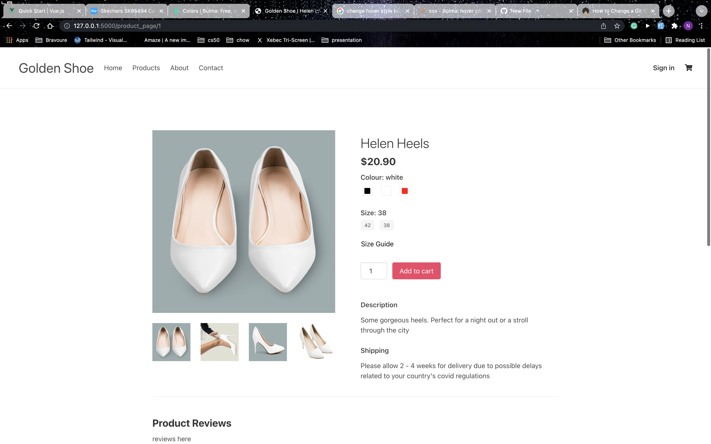

# GoldenShoe
---

## Description 
Product page demo for shoe company

## Languages, Libraries & Frameworks
* Python
* Flask 
* CSS
* Bulma
* HTML
* SQLite
* Peewee

## Setup 
1. Clone the repository and with Python3 create a virtual environment in the directory.
2. Activate the environment `source <your_env_name>/bin/activate`
3. Install the necessary dependencies `pip install -r requirements.txt`
4. Run `python main.py`. 

You should now see a 'goldenShoe.db' file appear in the current directory. You can now view the application on http://127.0.0.1:5000/

## Screenshots

